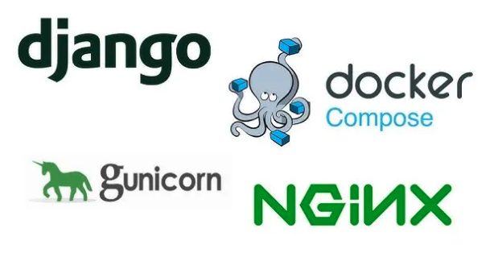

<<<<<<< HEAD

=======
<h1>Dockerizing Django Application with Gunicorn - Nginx - PostgreSQL</h1>

<h2>A free container platform including open-source Blog CMS based on the <strong>Django with Gunicorn, Nginx and PostgreSQL</strong></h2>

<h3>Django with Gunicorn</h3>

<h4>PyEditorial (Django Application) </h4>

It is a CMS application to be used as a container. For detailed information, visit https://github.com/mavenium/PyEditorial.

<h3>Nginx</h3>

Nginx was used in the mix to act as a reverse proxy for Gunicorn to handle client requests and serve static files.

<h3>PostgreSQL</h3>

PostgreSQL was used as the database. PostgreSQL information has been entered in the application's "settings.py" file.

 
>>>>>>> 78bde9c (Readme and screenshots arranging)
